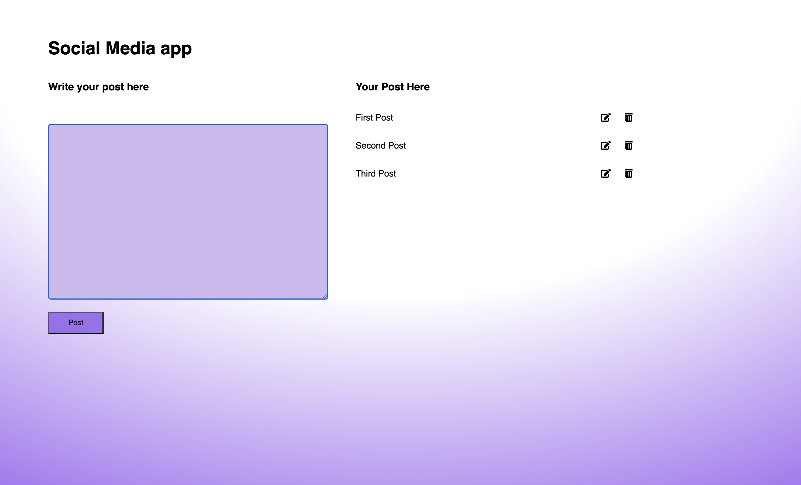

# Social Media App


A simple CRUD (Create, Read, Update, Delete) social media application built with vanilla JavaScript, HTML, and CSS.

## Screenshot



## Features

- Create new posts
- Edit existing posts
- Delete posts
- Form validation
- Responsive design

## Technologies Used

**HTML5** | **CSS3** | **JavaScript (ES6)**

## Key JavaScript Concepts Demonstrated

- **DOM Manipulation**: `getElementById()`, `innerHTML`, `textContent`
- **Event Handling**: `addEventListener()`, `preventDefault()`
- **Form Validation**: Input validation with user feedback
- **CRUD Operations**: Create, read, update, and delete functionality
- **Dynamic Content Generation**: Template literals for HTML injection
- **State Management**: Tracking editing state and post indices
- **Arrow Functions**: Modern ES6 syntax
- **Object Handling**: Data storage and manipulation

## CSS Features

- Flexbox layout for responsive design
- CSS gradients for modern styling
- Font Awesome icons integration
- Hover effects and interactive elements

## How to Run

1. Clone the repository
2. Open `index.html` in your browser
3. Start creating, editing, and deleting posts

## File Structure

```
├── index.html    # Main HTML structure
├── script.js     # JavaScript functionality
└── style.css     # Styling and layout
```

This project demonstrates fundamental web development skills and modern JavaScript practices essential for frontend development.
